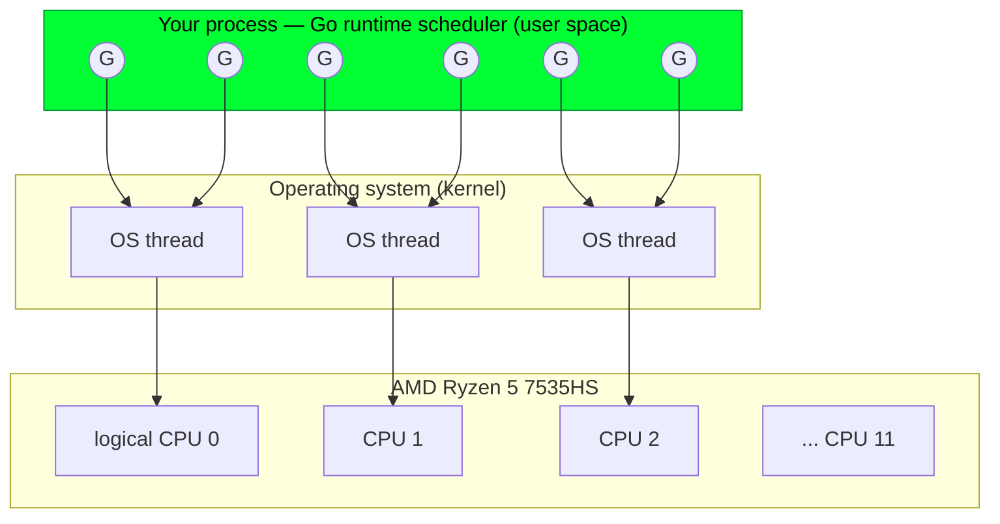
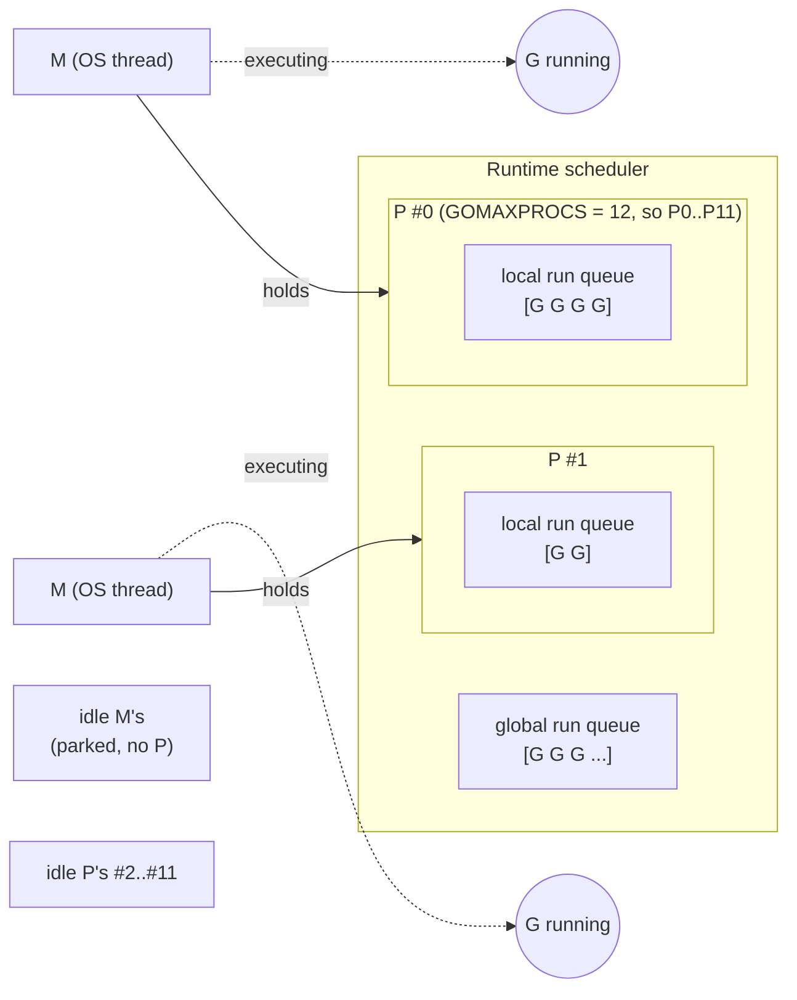
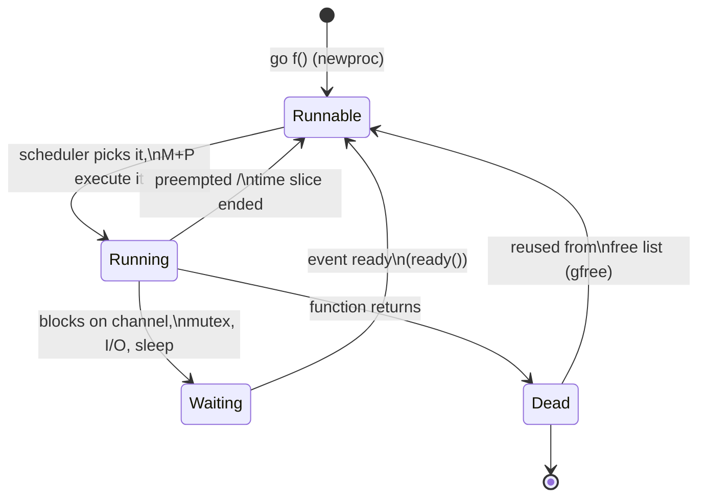
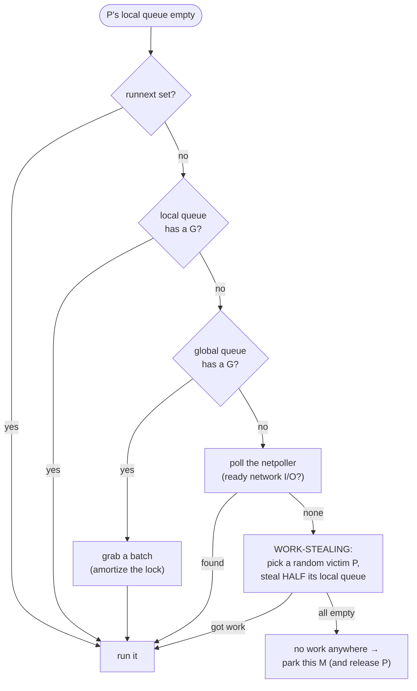
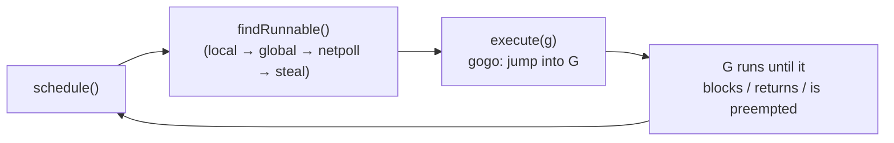
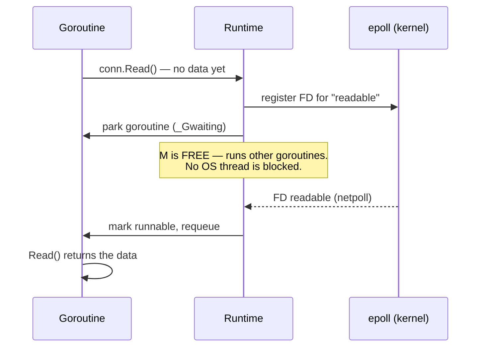
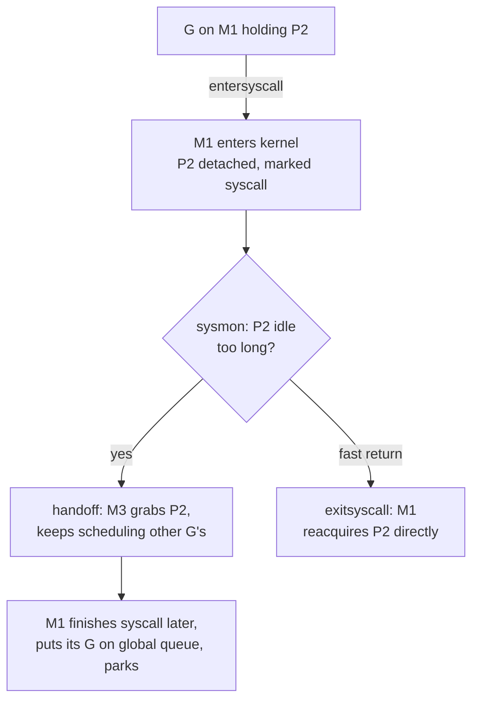
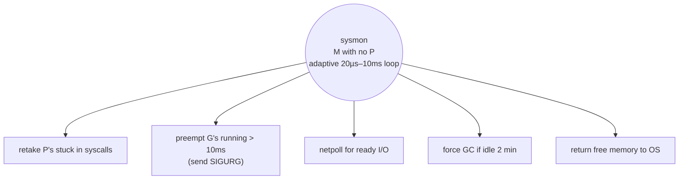

# Chapter 1 — The Go Runtime & Scheduler (GMP)

> *How a million goroutines run on twelve hardware threads.*

When you write `go doWork()`, you are not asking the operating system for a thread.
You are handing a small object to a scheduler that lives **inside your own process**,
written in Go, that will multiplex that work onto a handful of OS threads, which Linux
in turn multiplexes onto your CPU cores. This chapter is about that middle layer — the
**Go runtime scheduler** — because almost every performance and correctness question in
advanced Go eventually bottoms out here.

By the end you will be able to answer, precisely:

- Why is a goroutine ~2 KB and a thread ~1–8 MB?
- What are **G**, **M**, and **P**, and why does Go need all three?
- How does a goroutine that blocks on a syscall *not* block the others?
- How can a tight `for {}` loop with no function calls be preempted?
- What does `GOMAXPROCS` actually control on your 12-thread Ryzen?

---

## 1.1 Why a runtime scheduler exists at all

The operating system already schedules threads. Why does Go ship its own scheduler on top?

Because **OS threads are expensive**, in three ways:

1. **Memory.** Each OS thread reserves a fixed stack — typically 1–8 MB on Linux. A
   million threads would need terabytes of address space just for stacks. A goroutine
   starts with an **8 KB** stack that **grows and shrinks** on demand (the floor is 2 KB, which
   idle goroutines shrink back to). A million goroutines is gigabytes, not terabytes — and most
   never grow.

2. **Context-switch cost.** Switching OS threads means a trip through the kernel: save/restore
   the full register set, swap page-table/TLB state, run the kernel scheduler. That's hundreds
   of nanoseconds to microseconds. A goroutine switch is a **user-space** function call that
   swaps a few registers and a stack pointer — tens of nanoseconds, no kernel involved.

3. **Scheduling policy.** The kernel knows nothing about your program. The Go runtime knows
   exactly when a goroutine blocks on a channel, a mutex, or network I/O, and can instantly
   run something else on the same thread instead of parking the thread.

So Go runs an **M:N scheduler**: it multiplexes **M** goroutines onto **N** OS threads,
where N is small (tied to your core count) and M can be enormous.



The art is in the multiplexing. That is the GMP model.

---

## 1.2 The three actors: G, M, P

The scheduler is built from exactly three runtime structures. Internalize these three
letters; the rest of the chapter is just their interactions.

| | Name | Is | Roughly analogous to |
|---|---|---|---|
| **G** | Goroutine | A unit of work: a stack, a program counter, and scheduling status. | A task / closure to run. |
| **M** | Machine | An **OS thread**. The only thing that can actually execute instructions on a CPU. | A worker. |
| **P** | Processor | A **scheduling context**: the right to run Go code, plus a local run queue and caches. | A permit / workbench. |

The key insight that trips people up: **a goroutine (G) needs both an M and a P to run.**

- **M without P** can't run Go code — it's a thread with no permit (it might be blocked in a syscall, or parked).
- **P without M** is an idle workbench waiting for a worker to pick it up.
- **G** is the work that flows between run queues.

The number of P's is fixed at startup to **`GOMAXPROCS`**, which defaults to the number of
logical CPUs. On your Ryzen 7535HS that's **12**. So at most 12 goroutines run Go code *simultaneously*,
no matter how many million goroutines or OS threads exist.



### Why P exists (the part Go added in 1.1)

Early Go (pre-1.1) had only G and M with a single global run queue protected by one big lock.
Every scheduling decision contended on that lock, and it didn't scale past a few cores.

**P** was introduced to give each running M a **local, lock-free run queue** and **local caches**
(notably a per-P memory allocation cache, the `mcache`). Now the common case — push/pop a goroutine,
allocate a small object — touches only per-P state and needs no global lock. The global queue still
exists as a fallback and fairness mechanism, but it's off the hot path.

This is the single most important architectural idea in the scheduler: **make the common case
P-local and lock-free; fall back to global structures only occasionally.**

---

## 1.3 Mapping GMP onto your Ryzen 7535HS

Concrete hardware makes this real. Your CPU:

```
AMD Ryzen 5 7535HS
├── 6 physical cores
│   └── each core: 2 SMT threads  ──► 12 logical CPUs (0..11)
├── per-core L1 (data + instruction) and L2 cache
└── shared L3, single NUMA node
```

- **Linux** sees 12 logical CPUs and schedules OS threads (M's) onto them.
- **Go** sets `GOMAXPROCS = 12` by default → **12 P's**.
- So up to 12 M's can each hold a P and run Go code at once — one per logical CPU.

⚠️ **SMT is not free parallelism.** Two SMT threads on one physical core *share* that core's
execution units and L1/L2 cache. For cache-friendly, compute-bound work, 12 busy goroutines may
deliver closer to "6 cores' worth" of throughput than "12." This matters enormously in Chapter 7
(the 1BRC challenge), where we'll measure exactly how throughput scales from 1 → 6 → 12 workers.

📐 **Design note — GOMAXPROCS in containers.** If you run this binary in a container limited to,
say, 2 CPUs, Go ≥ 1.25 reads the cgroup CPU quota and sets `GOMAXPROCS` accordingly, instead of
seeing all 12 host CPUs and over-scheduling. On older Go you needed `automaxprocs`. We'll revisit
this in the services chapters — getting it wrong causes mysterious tail-latency in production.

🔬 Run [`code/ch01/topology`](../code/ch01/topology) to print what *your* runtime sees:

```bash
go run ./ch01/topology
```

```
NumCPU (logical CPUs Go sees) : 12
GOMAXPROCS (number of P's)    : 12
Current OS threads (approx)   : 5
```

---

## 1.4 A goroutine is a struct (and a tiny stack)

A G is just a heap object (`runtime.g`). The fields that matter for understanding scheduling:

```
runtime.g  (simplified)
┌────────────────────────────────────────────────┐
│ stack        lo/hi bounds of this G's stack     │
│ stackguard0  preemption / stack-growth check    │  ← the magic behind preemption
│ sched        saved PC, SP, BP when not running  │  ← how a G is "frozen" and resumed
│ atomicstatus _Grunnable / _Grunning / _Gwaiting │
│ m            the M running this G (if running)   │
│ goid         the goroutine id                    │
│ ...                                              │
└────────────────────────────────────────────────┘
```

When a goroutine is **not** running, its CPU registers (program counter, stack pointer) live in
`g.sched`. "Switching" a goroutine is: save the current registers into `g.sched`, load the next
G's `g.sched` into the CPU, and jump. No kernel, no syscall — `runtime·gogo` is a few dozen
assembly instructions. *This* is why goroutine switches are ~10× cheaper than thread switches.

### Growable stacks

A goroutine starts with a small contiguous stack (8 KB). Every function prologue contains a
cheap check: *is the stack about to overflow?* (that's what `stackguard0` is for). If yes, the
runtime allocates a **larger** stack, **copies** the old one over, fixes up pointers, and continues.
Stacks also shrink during GC if a goroutine is using far less than it allocated.

This is why "just spawn a goroutine" is cheap: you pay 8 KB up front, not 1 MB, and you only
grow if the work actually needs it.

🔬 [`code/ch01/goroutine-cost`](../code/ch01/goroutine-cost) spawns 1,000,000 goroutines and
reports the memory delta:

```bash
go run ./ch01/goroutine-cost
```

```
Spawned 1000000 goroutines (NumGoroutine=1000001)
Heap   :    0.3 MB  ->   601.4 MB  (Δ 601.1 MB)
Stacks :    0.4 MB  ->  2048.9 MB  (Δ 2048.4 MB)
Total per goroutine: ~2.59 KB  (heap+stack)
```

That's the real measured cost on this machine: ~2.6 KB per **parked** goroutine — ~0.6 KB of heap
(the `g` struct, the `sudog` wait record) plus ~2 KB of stack. The stacks started at 8 KB but
**shrank to the 2 KB minimum** because these goroutines are idle — exactly the growable-stack
behavior described above. Note the program measures **both** `HeapAlloc` *and* `StackInuse`, because
goroutine stacks are *not* counted in the heap.

Try the same thought experiment with 1,000,000 OS threads: you can't — at ~1 MB of stack each that's
a terabyte of address space, and you'll hit the OS thread limit long before. A million goroutines is
~2.6 GB and routine.

### Goroutine lifecycle



Dead G's aren't freed; they're cached on a free list (`gfree`) and reused, so steady-state
goroutine churn allocates almost nothing.

---

## 1.5 Run queues and work-stealing

Where do runnable goroutines wait for a P? In **run queues**. There are two tiers:

- **Per-P local run queue** — a lock-free ring buffer holding up to **256** G's. This is the fast path.
- **Global run queue** — a linked list protected by a lock, for overflow and fairness.

When you do `go f()`, the new G is normally pushed onto the **current P's local queue** (with a
fast-path slot called `runnext` for the *very next* G, which helps producer/consumer locality).

When a P's local queue is empty, its M doesn't go idle immediately. It runs `findRunnable`, which
hunts for work in a specific order — and if everything local is empty, it **steals**:



**Work-stealing** is what keeps all 12 P's busy under uneven load. If P#3 has a burst of 200
goroutines and P#7 is idle, P#7's M will randomly probe other P's, find P#3, and steal ~100 of
its goroutines in one shot. Stealing **half** (not one) amortizes the cost and spreads load fast.

📐 Why steal a random victim instead of "the busiest"? Because finding "the busiest" requires
scanning all P's (O(P)) on every steal — contention and cache traffic. Random victim selection is
O(1), and over many steals it statistically balances. Simpler and faster wins.

### Fairness: don't let the global queue starve

A purely local-first design could starve the global queue (and thus goroutines that got pushed
there). So the runtime injects fairness: roughly **every 61st scheduling tick**, a P checks the
**global** queue *first* before its local one. The magic number 61 is a prime chosen to avoid
resonance with common loop counts. Small detail, but it's why a flood of locally-spawned goroutines
can't permanently starve one sitting in the global queue.

🔬 [`code/ch01/work-stealing`](../code/ch01/work-stealing) spawns a lopsided burst of CPU work
and prints, via `GODEBUG=schedtrace`, how goroutines spread across P's. Run it with the trace on:

```bash
GODEBUG=schedtrace=1000,scheddetail=0 go run ./ch01/work-stealing
```

You'll see lines like:

```
SCHED 1000ms: gomaxprocs=12 idleprocs=0 threads=14 ... runqueue=3 [5 4 0 6 ...]
```

`runqueue=3` is the global queue length; the bracketed list is each P's local queue length.
Watch the lengths even out over time — that's work-stealing happening live.

---

## 1.6 The scheduler loop

Strip away the details and every M running Go code is in this loop:



- **`schedule()`** — entry point; decides what to run next (including the every-61st-tick global check).
- **`findRunnable()`** — the search-and-steal logic from §1.5. It either returns a G or **parks the M**.
- **`execute()` → `gogo`** — loads the G's saved registers and jumps into its code.

When a running G blocks (say on a channel receive), the runtime calls `gopark`, which:
1. sets the G's status to `_Gwaiting`,
2. detaches it from the M,
3. calls `schedule()` again on the same M+P to find new work.

When the blocking event fires (a sender arrives), `goready` flips the G back to `_Grunnable` and
puts it on a run queue. The G didn't burn a thread while waiting — that's the whole point.

---

## 1.7 Syscalls and the netpoller: blocking without blocking everyone

Here's the problem that makes naive M:N schedulers fall over: **what happens when a goroutine
makes a blocking syscall** (reading a file, a slow `read()` on a socket)? The OS thread (M) is
now stuck in the kernel. If that M was holding a P, that P — one of your precious 12 — is frozen
too. Do that 12 times and your whole program stalls despite having idle CPUs.

Go solves this with **two different strategies** depending on the kind of blocking.

### Network I/O → the netpoller (no thread is blocked)

For sockets, Go does **not** make a blocking syscall. It puts every network FD into an OS
readiness API — **epoll** on Linux (kqueue on BSD/macOS, IOCP on Windows) — in non-blocking mode.
When your goroutine does `conn.Read()` and no data is ready:

1. The goroutine **parks** (`_Gwaiting`) — *not* the thread.
2. The FD is registered with the netpoller.
3. The M is freed to run other goroutines.

A background mechanism polls epoll (both in the scheduler's `findRunnable` and periodically via
`sysmon`). When the FD becomes readable, the parked goroutine is made runnable again.



This is why a Go server can hold **hundreds of thousands of idle connections** on a handful of
threads: each idle connection costs one parked goroutine (~few KB), not one blocked OS thread.
We'll lean on this hard in the networking chapters (11–13).

### Blocking syscalls → handoff (P is rescued)

Some syscalls genuinely block the thread (file I/O on most setups, CGO calls, DNS via libc).
Around such a call, the runtime wraps it with `entersyscall` / `exitsyscall`:

- **`entersyscall`** detaches the P from the M and marks it "in syscall." The M dives into the kernel.
- If the syscall is slow, **`sysmon`** (§1.9) notices the P has been in-syscall too long and
  **hands the P off** to another M (waking or creating one). That M takes the P and keeps running
  the other 11 cores' worth of goroutines. The blocked M just waits in the kernel with no P.
- **`exitsyscall`** — when the call returns, the M tries to reacquire a P. If one's free, great;
  otherwise the now-runnable G is dropped on the global queue and the M parks.



The upshot: **one goroutine doing slow file I/O cannot freeze a scheduling slot.** The number of
M's can temporarily exceed `GOMAXPROCS` (you'll see `threads=14` in schedtrace even with 12 P's) —
that's the runtime spinning up extra M's to cover for ones stuck in syscalls.

⚠️ **CGO and blocking C calls** go through the same syscall machinery and tie up an M for their
whole duration. A flood of slow CGO calls can spawn many M's. This is a classic production
surprise — keep CGO off the hot path or bound its concurrency.

---

## 1.8 Preemption: how a tight loop gets interrupted

Question that separates people who *think* they understand the scheduler from people who do:

```go
func main() {
    runtime.GOMAXPROCS(1)         // one P
    go func() { for {} }()        // a goroutine that never blocks, never calls a function
    time.Sleep(time.Millisecond)
    fmt.Println("did this print?") // ... on Go 1.14+, YES.
}
```

With one P and a goroutine spinning in `for {}`, how does `main` ever get to run? The spinner
never blocks, never allocates, never calls a function. The scheduler only gets control when a
goroutine *voluntarily* yields... so what yields here?

**The answer changed in Go 1.14.**

### Cooperative preemption (pre-1.14, still present)

Go's preemption was **cooperative**: the compiler inserts a preemption check at every **function
call's prologue** (it reuses the stack-growth check on `stackguard0`). When the runtime wants to
preempt a goroutine, it sets a flag; the next time that goroutine calls *any* function, the
prologue sees the flag and yields to the scheduler.

The fatal gap: a loop with **no function calls** (like `for {}`, or a tight numeric loop the
compiler inlined and unrolled) has **no prologue to check the flag**. Such a goroutine could hog
its P forever — historically this could stall garbage collection and starve other goroutines.

### Asynchronous preemption (Go 1.14+)

Modern Go adds **signal-based async preemption**. `sysmon` notices a goroutine has been running
> ~10 ms and asks the runtime to preempt it. The runtime sends the M a **`SIGURG`** signal. The
signal handler runs on that thread, and — at a point the runtime knows is safe (GC-safe register
state) — it redirects the goroutine into the scheduler, parking it.

```mermaid
sequenceDiagram
    participant Loop as G: for {}
    participant Sysmon as sysmon
    participant Kernel as kernel
    participant Handler as signal handler (on M)
    Note over Loop: running > 10ms, no function calls
    Sysmon->>Sysmon: detect long-running G
    Sysmon->>Kernel: tgkill(M, SIGURG)
    Kernel->>Handler: deliver SIGURG to the thread
    Handler->>Loop: redirect to scheduler at safe point
    Note over Loop: goroutine parked, P freed for main
```

So on Go 1.14+, the program above **does** print. Try it yourself:

🔬 [`code/ch01/preemption`](../code/ch01/preemption):

```bash
go run ./ch01/preemption
# prints "preempted: main ran" — thanks to async preemption
```

You can watch the SIGURG traffic (each preemption is a signal delivery):

```bash
GODEBUG=asyncpreemptoff=1 go run ./ch01/preemption   # disable it...
# ...now the program HANGS: main never runs. Ctrl-C to kill.
```

That `asyncpreemptoff=1` experiment is the cleanest possible proof that async preemption is real
and load-bearing. ⚠️ It also shows why, before 1.14, "accidentally tight loop" was a real way to
freeze a Go service during GC.

---

## 1.9 `sysmon`: the runtime's background monitor

Several mechanisms above ("notices the syscall is slow," "notices the goroutine ran too long")
point at the same actor: **`sysmon`** (system monitor). It's a special M that runs **without a P**,
in a loop, independent of normal scheduling. Its polling interval adapts from ~20 µs up to 10 ms.

`sysmon`'s responsibilities:

- **Retake P's** from goroutines stuck in syscalls (the handoff in §1.7).
- **Async-preempt** goroutines running longer than ~10 ms (§1.8).
- **Poll the netpoller** to catch ready network I/O even when all M's are busy.
- **Force a GC** if one hasn't run in 2 minutes.
- **Scavenge** unused memory back to the OS.



Think of `sysmon` as the watchdog that makes the otherwise-cooperative scheduler robust against
misbehaving goroutines and slow syscalls. Without it, the fast P-local design would be fragile.

---

## 1.10 Spinning, parking, and idle threads

When an M can't find work, it doesn't immediately go to sleep. A bounded number of M's are allowed
to **spin** — actively probe other P's run queues and the netpoller for a short while — before
parking. Spinning trades a little CPU for **latency**: if work appears, a spinning M grabs it in
nanoseconds instead of paying the cost to wake a parked thread (a futex wakeup, ~microseconds).

The rule: keep at most a few spinning M's; once one finds work, wake/create another so there's
always someone watching, but never let all idle M's busy-loop (that would waste whole cores).

This is the same latency-vs-CPU tradeoff you'll see again in spinlocks (Ch 3/4) and in the
`sync.Mutex` fast path (Ch 2): *spin briefly, then sleep.*

---

## 1.11 Observing the scheduler

You don't have to take any of this on faith. The runtime exposes several windows.

### `GODEBUG=schedtrace`

Prints a one-line scheduler summary every N ms:

```bash
GODEBUG=schedtrace=1000 go run ./ch01/work-stealing
```
```
SCHED 1003ms: gomaxprocs=12 idleprocs=7 threads=14 spinningthreads=1 idlethreads=4 runqueue=2 [0 1 0 0 3 0 2 0 0 0 0 0]
```
- `idleprocs` — P's with no work right now.
- `threads` — total M's (note **> 12**: extras cover syscalls).
- `spinningthreads` — M's currently probing for work (§1.10).
- `runqueue` — global queue length; `[...]` — each P's local queue length.

Add `scheddetail=1` for per-G/per-M/per-P breakdowns (verbose — use for debugging a specific stall).

### `runtime/trace` (the execution tracer)

For visual, microsecond-resolution analysis — see exactly which goroutine ran on which P when,
GC pauses, syscall blocking, and network-wait. This is the gold standard and we'll use it heavily
in Chapter 6.

🔬 [`code/ch01/exectrace`](../code/ch01/exectrace) writes a `trace.out`; open it with:

```bash
go run ./ch01/exectrace          # writes trace.out
go tool trace trace.out          # opens the web UI
```

In the UI, the "Goroutine analysis" and per-P timeline views make work-stealing and preemption
*visible*. Spend ten minutes here — it builds intuition no amount of prose can.

### Other knobs worth knowing

| Knob | What it shows / does |
|---|---|
| `GODEBUG=schedtrace=1000` | periodic scheduler summary |
| `GODEBUG=asyncpreemptoff=1` | disable async preemption (proves §1.8) |
| `GOMAXPROCS=n` env or `runtime.GOMAXPROCS(n)` | number of P's |
| `runtime.NumGoroutine()` | live goroutine count |
| `GODEBUG=gctrace=1` | GC timing (touches the scheduler via STW) |

---

## 1.12 Practical consequences (what this buys you as an engineer)

The model isn't trivia — it directly drives design decisions you'll make in later chapters.

1. **Goroutines are cheap, but not free.** ~8 KB + scheduling overhead each. Spawning a goroutine
   *per item* for a million tiny items thrashes the scheduler and GC. **Bound concurrency** with a
   worker pool sized near `GOMAXPROCS` for CPU work (Chapter 2).

2. **CPU-bound work scales to cores, not goroutines.** Twelve goroutines crunching numbers use your
   twelve logical CPUs; the 13th just waits. More goroutines than `GOMAXPROCS` for pure CPU work
   adds context-switch overhead, not speed. (And remember SMT: 12 logical ≠ 12× a single core.)

3. **I/O-bound work scales far past cores.** Ten thousand goroutines each waiting on a socket is
   *fine* — they're parked, costing memory, not threads. This is why Go shines for network servers.

4. **Don't block an M unnecessarily.** Pure-Go blocking (channels, mutex, network) parks the
   goroutine and frees the M. **Syscalls and CGO** tie up an M. Keep slow syscalls/CGO off hot paths,
   or bound them, so you don't spawn a swarm of M's.

5. **`GOMAXPROCS` must match your real CPU budget.** On bare metal, the default (12 here) is right.
   In a CPU-limited container, ensure Go sees the cgroup quota (Go ≥ 1.25 does this automatically),
   or you'll over-schedule and suffer tail latency.

---

## 1.13 Pitfalls & gotchas

- ⚠️ **Tight loops before Go 1.14** could starve GC and other goroutines. You're on 1.26, so async
  preemption protects you — but understand *why* an old binary or `asyncpreemptoff=1` can hang.
- ⚠️ **`runtime.Gosched()` is rarely the answer.** Manually yielding usually masks a design problem
  (an unbounded loop, a missing channel). Reach for it almost never.
- ⚠️ **`runtime.LockOSThread()`** pins a goroutine to its M (needed for some C libraries, OpenGL,
  syscalls with thread-local state). It removes that M from normal multiplexing — use deliberately.
- ⚠️ **Don't equate `NumGoroutine()` spikes with a leak by themselves** — but a *monotonically
  rising* count is the classic goroutine-leak signature (Chapter 2 covers prevention).
- ⚠️ **More `GOMAXPROCS` is not more speed.** Setting it above your CPU count just adds scheduling
  overhead and cache contention.

---

## 1.14 Summary

- Go runs an **M:N scheduler** in user space: many goroutines on few OS threads on your CPUs.
- **G** = work (stack + status), **M** = OS thread, **P** = scheduling permit with a **local
  lock-free run queue** and caches. A G needs **both an M and a P** to run. There are `GOMAXPROCS`
  P's — **12** on your Ryzen 7535HS.
- The hot path is **P-local and lock-free**; the **global queue**, **work-stealing** (steal half a
  random victim's queue), and an **every-61st-tick** global check provide balance and fairness.
- Goroutines have **small, growable stacks** (8 KB) and switch in user space (`gogo`), ~10× cheaper
  than thread switches.
- **Network I/O** uses the **netpoller (epoll)** — the goroutine parks, no thread blocks; **blocking
  syscalls/CGO** use **P handoff** so a stuck M doesn't freeze a P.
- **Async preemption** (Go 1.14+, via `SIGURG`) stops even function-call-free tight loops; **`sysmon`**
  is the watchdog driving handoffs, preemption, netpolling, and GC kicks.
- These mechanics dictate real design rules: **bound CPU-bound concurrency near `GOMAXPROCS`**, let
  **I/O-bound concurrency** run wide, and **keep syscalls/CGO off hot paths**.

### Where this goes next

Chapter 2 builds directly on this: now that you know *how* goroutines are scheduled, we'll look at
how they **communicate and synchronize** — channels (`hchan`) and the `sync` package — and the
production patterns (pipelines, worker pools, `errgroup`) for wiring them together without leaks.
Chapter 3 then drops beneath the runtime to the **memory model and AMD64 hardware** that make
`atomic` and lock-free programming (Chapter 4) possible.

> **Run everything in this chapter:** `cd go-advanced/code && go run ./ch01/<dir>`
> See [`code/ch01/`](../code/ch01) for `topology`, `goroutine-cost`, `work-stealing`,
> `preemption`, and `exectrace`.
