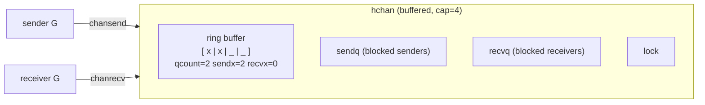
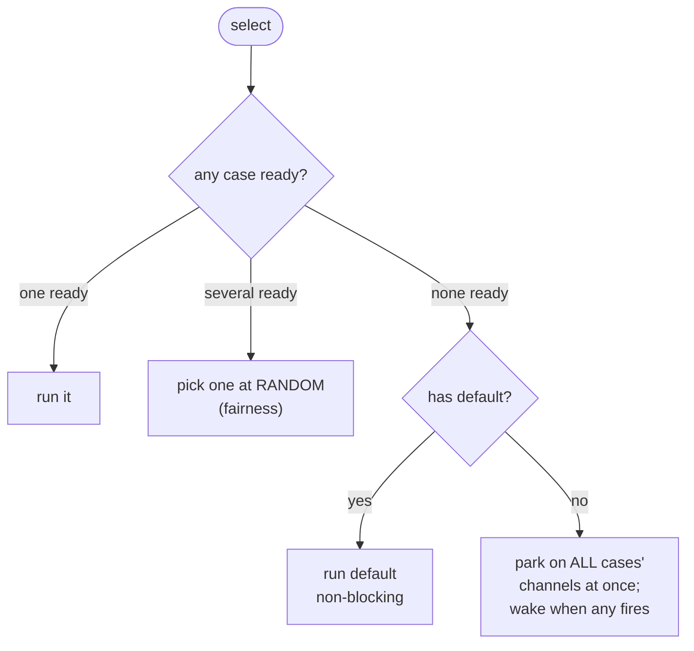
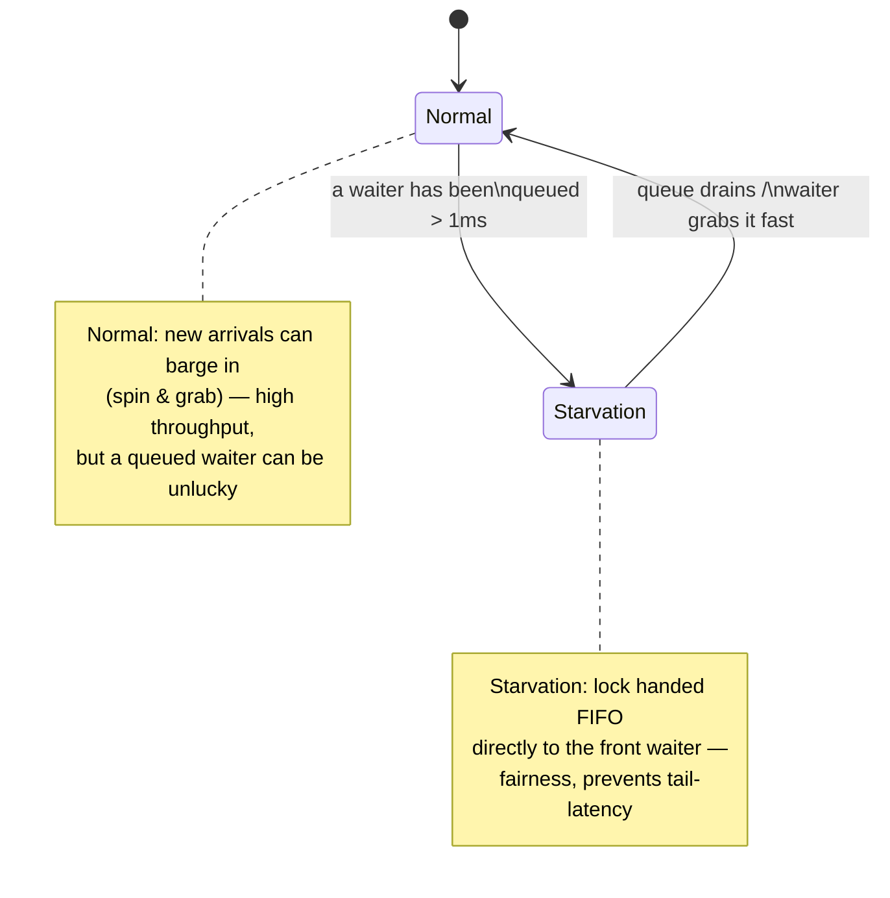
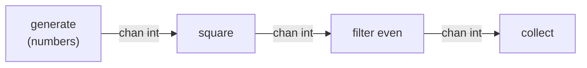
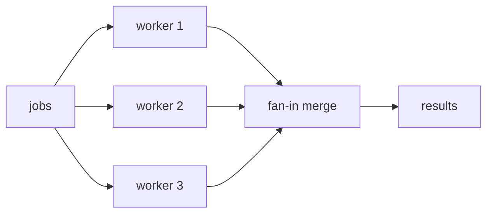
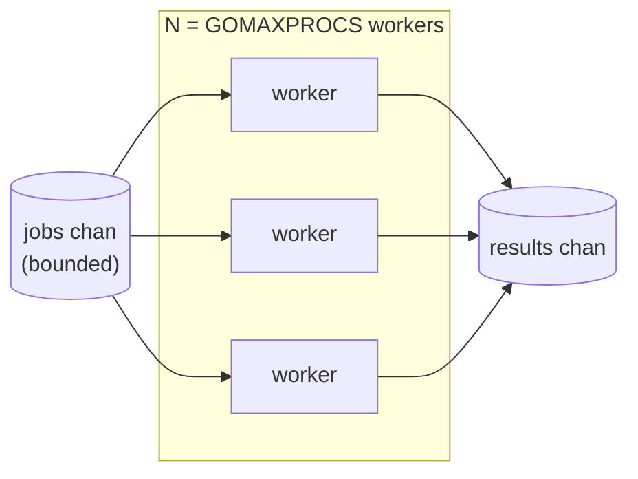
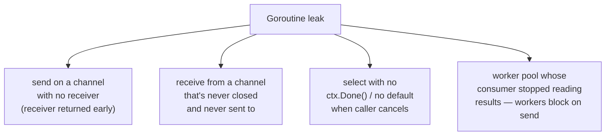

# Chapter 2 — Channels, Synchronization & Concurrency Patterns

> *Chapter 1 showed how goroutines are scheduled. This chapter is how they talk to each
> other without corrupting state or leaking — and the patterns that make that production-grade.*

Go gives you two ways to coordinate goroutines:

- **Communicate** — pass data through **channels** ("share memory by communicating").
- **Synchronize** — guard shared memory directly with the **`sync`** package and atomics.

Most bugs in concurrent Go come from picking the wrong tool, or from a goroutine with no
defined exit. This chapter goes under the hood of both tools, then assembles them into the
production patterns you'll reuse for the rest of the book — and shows how to prove your code
is leak-free.

> We deliberately defer the *deep* atomics + memory-model treatment to Chapter 3. Here we use
> atomics at face value and focus on channels, `sync`, and patterns.

---

## 2.1 A channel is a struct with a lock and two queues

A channel is not magic compiler syntax — `make(chan T, n)` allocates a `runtime.hchan` on the heap
and the `<-` operators are calls into `runtime.chansend` / `runtime.chanrecv`. Here's the structure
that matters:

```
runtime.hchan  (simplified)
┌───────────────────────────────────────────────────────────┐
│ qcount    uint     // # elements currently in the buffer   │
│ dataqsiz  uint     // buffer capacity (the n in make)      │
│ buf       *T       // ring buffer of dataqsiz elements     │  ← only for buffered channels
│ sendx     uint     // ring buffer write index              │
│ recvx     uint     // ring buffer read index               │
│ sendq     waitq    // FIFO of goroutines blocked on SEND   │  ← parked G's (sudog)
│ recvq     waitq    // FIFO of goroutines blocked on RECV   │
│ lock      mutex    // protects every field above           │
└───────────────────────────────────────────────────────────┘
```

Two takeaways up front:

1. **A channel has its own little lock.** Every send/receive briefly acquires `hchan.lock`. Channels
   are *not* lock-free; they're a well-optimized lock + queues. For very hot single-value coordination,
   an atomic (Ch 3–4) can be cheaper — but channels buy you clarity and ownership semantics.
2. **Blocked goroutines park in `sendq`/`recvq`.** When you block on a channel, your goroutine becomes
   a `sudog` in one of these FIFO queues and goes `_Gwaiting` (Chapter 1) — it costs memory, not a thread.



### The send/receive decision tree

`chansend` (and symmetrically `chanrecv`) does this under the lock:

```mermaid
flowchart TD
    send([send v on ch]) --> q1{a receiver waiting\nin recvq?}
    q1 -- yes --> direct["hand v DIRECTLY to that\nreceiver's stack, wake it.\n(buffer untouched)"]
    q1 -- no --> q2{buffered &&\nbuffer has room?}
    q2 -- yes --> copy["copy v into ring buffer,\nqcount++ — return immediately"]
    q2 -- no --> q3{non-blocking?\n(select default)}
    q3 -- yes --> fail["return 'not sent'"]
    q3 -- no --> park["park sender in sendq\n(_Gwaiting) until a receiver arrives"]
```

The **direct hand-off** case is a lovely optimization: if a receiver is already waiting, the sender
copies the value straight into the receiver's frame and marks it runnable — the value never touches
the buffer. Unbuffered channels are *always* this hand-off (rendezvous): sender and receiver must
both be present.

### Buffered vs unbuffered — what the buffer really means

- **Unbuffered (`make(chan T)`)** — a **synchronization point**. Send blocks until a receiver is
  ready; the exchange is a rendezvous. Use it when you want the two goroutines to *meet*.
- **Buffered (`make(chan T, n)`)** — a **bounded queue** decoupling producer and consumer by up to
  `n` items. Use it to absorb bursts or to limit in-flight work.

📐 The house rule (from the `golang-concurrency` skill): **default to unbuffered.** A buffer hides
backpressure — if your consumer is slow, an unbuffered channel makes the producer *feel* it
immediately, which is usually what you want. Reach for a buffer only with a measured reason (batching,
known burst size, decoupling a known-bursty producer).

---

## 2.2 The rules that keep channels safe

These aren't style preferences; each maps to a runtime behavior.

| Rule | Why (mechanism) |
|---|---|
| **Only the sender closes a channel.** | `close` then `send` panics. The receiver can't know if the sender is done, so ownership of `close` must sit with the sender. |
| **Closing signals "no more values."** Receivers get the zero value + `ok=false`. | `v, ok := <-ch`; ranging over a channel exits cleanly on close. This is the idiomatic broadcast-completion mechanism. |
| **Send copies, never share pointers** through channels. | Sending a `*T` creates invisible shared memory — defeats "share by communicating" and reopens data races. Send values; if you must send a pointer, transfer *ownership* and never touch it again. |
| **Specify direction** (`chan<- T`, `<-chan T`) in signatures. | The compiler enforces who may send vs receive — bugs become build errors. |
| **Always include `ctx.Done()` in `select`** when a goroutine can outlive its caller. | Without an exit case, a blocked send/receive leaks the goroutine forever (§2.7). |

### Behavior of nil and closed channels (memorize this table)

This table is the source of half of all channel bugs. Both `nil` and closed channels have
*defined, useful* behavior:

| Operation | `nil` channel | open channel | **closed** channel |
|---|---|---|---|
| **send** `ch <- v` | blocks **forever** | sends (or blocks) | **panic** |
| **receive** `<-ch` | blocks **forever** | receives (or blocks) | returns **zero, `ok=false`** immediately |
| **close** `close(ch)` | **panic** | closes | **panic** (double close) |

The "blocks forever" rows look like footguns but are a **feature**: setting a channel variable to
`nil` **disables that case in a `select`**. We'll use this in §2.4 to cleanly drain pipelines.

---

## 2.3 `select`: waiting on many channels

`select` blocks until *one* of its communications can proceed. Semantics:

- If **multiple** cases are ready, one is chosen **pseudo-randomly** (fairness — prevents a busy
  channel from starving others). This randomization is real: don't rely on ordering.
- A **`default`** case makes the `select` **non-blocking**: if nothing else is ready, `default` runs.
- A `select` with **no cases** (`select {}`) blocks forever (occasionally used to park `main`).



Under the hood, a blocking `select` enqueues the goroutine as a `sudog` on *every* involved channel's
wait queue simultaneously; whichever fires first dequeues it from all the others. That's why `select`
can wait on many channels without spawning helper goroutines.

The canonical non-blocking patterns:

```go
// Non-blocking send (drop if no receiver / full buffer):
select {
case ch <- v:
default: // dropped
}

// Non-blocking receive:
select {
case v := <-ch:
    use(v)
default: // nothing available
}

// Wait for work OR cancellation — the most important select in production Go:
select {
case work := <-jobs:
    handle(work)
case <-ctx.Done():
    return ctx.Err()   // caller cancelled / deadline hit — clean exit
}
```

⚠️ **`time.After` in a hot `select` loop allocates a timer every iteration** and the timer isn't
collected until it fires. In a long-running loop, use a single `time.NewTimer` and `Reset` it, or
a `time.Ticker`. (Straight from the `golang-concurrency` skill — a real source of slow leaks.)

---

## 2.4 Worked example: a pipeline with clean shutdown

The `nil`-channel-disables-a-select trick, made concrete. A pipeline stage that merges until both
inputs drain, while honoring cancellation:

```go
func merge(ctx context.Context, a, b <-chan int) <-chan int {
    out := make(chan int)
    go func() {
        defer close(out) // this goroutine OWNS out, so it closes out
        for a != nil || b != nil {
            select {
            case v, ok := <-a:
                if !ok {
                    a = nil // drained: disable this case, keep draining b
                    continue
                }
                send(ctx, out, v)
            case v, ok := <-b:
                if !ok {
                    b = nil
                    continue
                }
                send(ctx, out, v)
            case <-ctx.Done():
                return // cancelled: defer closes out, no leak
            }
        }
    }()
    return out
}
```

Setting `a = nil` after it closes turns its `select` case into "blocks forever," i.e. effectively
removes it — so the loop naturally winds down to just `b`, then exits. Full runnable version:
[`code/ch02/pipeline`](../code/ch02/pipeline).

---

## 2.5 The `sync` package: when shared memory is simpler

Channels model *ownership transfer*. But sometimes you just have shared state that several
goroutines read and write — a counter, a cache, a config. Forcing that through channels is
awkward; a lock is clearer. The `golang-concurrency` skill's decision table:

| Scenario | Use | Why |
|---|---|---|
| Passing data / transferring ownership | **channel** | communicates the hand-off |
| Coordinating lifecycle / shutdown | **channel + context** | clean `select` exit |
| Protecting a few struct fields | **`sync.Mutex` / `RWMutex`** | simple critical section |
| Simple counters / flags | **`sync/atomic`** | lock-free, lowest overhead (Ch 3) |
| Read-heavy concurrent map | **`sync.Map`** | optimized for read-mostly; ⚠️ a plain map with concurrent read+write **crashes** |
| Run-once / dedupe expensive work | **`sync.Once` / `singleflight`** | execute once / collapse duplicate calls |

### `sync.Mutex` — more than a flag

A `Mutex` is two words: an `int32 state` (locked bit, woken bit, starving bit, and a waiter count)
plus a `uint32 sema` semaphore for parking. It has a **fast path** and a **slow path**:

- **Uncontended** (`Lock` on a free mutex): a single atomic CAS flips the locked bit. No syscall,
  no parking — nanoseconds. This is the common case and it's cheap.
- **Contended**: the goroutine **spins** a few times (betting the holder releases imminently — same
  spin-then-sleep logic as the scheduler in Ch 1), then parks on the semaphore via a futex.

Go's mutex has **two modes** to balance throughput against fairness:



- **Normal mode** favors throughput: an incoming goroutine can "barge" and grab the lock ahead of
  goroutines already queued (they may be mid-wakeup). Fast, but risks tail latency for an unlucky waiter.
- **Starvation mode** (triggered when a waiter has waited > 1 ms): the lock is handed off **FIFO**
  directly to the front of the queue; no barging. Restores fairness, then switches back.

You don't toggle these — the runtime does. But knowing they exist explains why mutex latency is
usually tiny yet bounded under contention.

⚠️ **`Mutex` is not reentrant.** Locking it twice from the same goroutine deadlocks. ⚠️ **Never copy
a `Mutex`** after first use (copy a struct containing one and you've copied the lock state — `go vet`
catches this). Embed by pointer or don't copy the struct.

### `sync.RWMutex` — many readers, one writer

`RLock`/`RUnlock` allow unlimited concurrent readers; `Lock` is exclusive. 📐 It only pays off when
reads **vastly** outnumber writes **and** the critical section is non-trivial — `RWMutex` has more
internal bookkeeping than `Mutex`, so for short critical sections a plain `Mutex` is often *faster*.
Measure (Ch 6). Also: a writer waiting blocks new readers, preventing writer starvation.

### `WaitGroup`, `Once`, `Pool`, `Cond`

- **`sync.WaitGroup`** — wait for a set of goroutines to finish. `Add(n)` **before** launching,
  `Done()` in each (via `defer`), `Wait()` to join. ⚠️ Calling `Add` *inside* the goroutine races
  with `Wait`. (Go 1.25 added `wg.Go(func)` which fuses `Add(1)`+`go`+`Done` — prefer it when available.)
- **`sync.Once`** — `once.Do(f)` runs `f` exactly once, ever, even under concurrent callers; all
  callers block until the first completes. The idiomatic lazy-init / singleton primitive.
- **`sync.Pool`** — a free-list of reusable objects to cut allocations/GC pressure on hot paths.
  ⚠️ The pool is cleared at (well, around) every GC, and a `Get` may return a brand-new object —
  so only pool things that are cheap to recreate and safe to drop. Heavily used in Ch 6–9.
- **`sync.Cond`** — condition variable for "wait until a predicate holds." Niche; a channel is
  usually clearer. Reach for it only for true many-waiter broadcast on a shared predicate.

---

## 2.6 Production patterns

These are the reusable shapes. All are in [`code/ch02/`](../code/ch02) as runnable, tested code.

### Pattern 1 — Pipeline (fan stages, back-pressured by channels)

Each stage is a goroutine reading from an input channel and writing to an output channel. Stages
run concurrently; unbuffered channels give natural back-pressure (a fast stage waits for a slow one).



The owner of each output channel is the goroutine writing to it, and that goroutine closes it on
exit — so closes cascade down the pipeline and everything terminates cleanly.

### Pattern 2 — Fan-out / Fan-in (parallelize a stage)

When one stage is the bottleneck, run **M copies** of it (fan-out) reading the same input, then
**merge** their outputs (fan-in). Bound M near `GOMAXPROCS` for CPU-bound stages (Chapter 1, rule 2).



### Pattern 3 — Bounded worker pool (the workhorse)

The single most useful pattern in production Go: a fixed set of N workers pulling from a jobs
channel. It **bounds concurrency** (protecting downstreams — DBs, APIs — from overload) and **bounds
memory** (only N jobs in flight). This is how you process a million items without spawning a million
goroutines (Chapter 1, rule 1).



Skeleton (full version with `context` + error handling in [`code/ch02/workerpool`](../code/ch02/workerpool)):

```go
func Run(ctx context.Context, jobs <-chan Job, workers int) <-chan Result {
    results := make(chan Result)
    var wg sync.WaitGroup
    wg.Add(workers)
    for i := 0; i < workers; i++ {
        go func() {
            defer wg.Done()
            for {
                select {
                case <-ctx.Done():
                    return                     // cancellation: clean exit
                case job, ok := <-jobs:
                    if !ok {
                        return                 // jobs drained: clean exit
                    }
                    select {
                    case results <- process(job):
                    case <-ctx.Done():
                        return                 // don't block forever on a dead consumer
                    }
                }
            }
        }()
    }
    go func() { wg.Wait(); close(results) }()  // owner closes results once all workers done
    return results
}
```

Note **every** blocking operation pairs with `ctx.Done()` — there is no path where a worker can
block forever. That's the structured-concurrency discipline that prevents leaks.

### Pattern 4 — `errgroup`: structured concurrency with error + cancellation propagation

`golang.org/x/sync/errgroup` is `WaitGroup` + first-error capture + shared `context` cancellation.
When any goroutine returns an error, the group's context is cancelled so the siblings can bail out
early. `g.SetLimit(n)` even turns it into a bounded pool. This is the **default** way to run a fixed
set of related concurrent tasks in production code.

```go
g, ctx := errgroup.WithContext(ctx)
g.SetLimit(runtime.GOMAXPROCS(0)) // bound concurrency to cores
for _, url := range urls {
    g.Go(func() error {
        return fetch(ctx, url) // if this errors, ctx cancels the others
    })
}
if err := g.Wait(); err != nil {     // returns the FIRST error
    return fmt.Errorf("fetching: %w", err)
}
```

Runnable: [`code/ch02/errgroup-fetch`](../code/ch02/errgroup-fetch).

### Pattern 5 — Semaphore (bound concurrency without a pool)

When you don't want a worker pool but still need to cap in-flight work, a **buffered channel as a
counting semaphore** is the lightest tool:

```go
sem := make(chan struct{}, maxConcurrent)
for _, task := range tasks {
    sem <- struct{}{}            // acquire (blocks if maxConcurrent in flight)
    go func() {
        defer func() { <-sem }() // release
        do(task)
    }()
}
```

(`golang.org/x/sync/semaphore` adds weighted acquisition and context support for the fancier cases.)

### Pattern 6 — `singleflight`: collapse duplicate work

If 100 requests all miss the cache for the *same* key at once, you don't want 100 identical DB
queries. `golang.org/x/sync/singleflight` ensures only **one** in-flight call per key; the other 99
wait and share its result. Essential for cache-stampede protection (we'll use it in the services
chapters).

---

## 2.7 Goroutine leaks: the #1 concurrency bug

A goroutine **leaks** when it blocks forever with no way to exit. It's not freed, its stack stays
live, anything it references stays live. Leaks are silent until you've accumulated enough to exhaust
memory. The classic causes:



### The canonical leak and its fix

```go
// ⚠️ LEAKS: if the caller returns early (timeout), nobody ever receives from ch,
// so the goroutine blocks forever on `ch <- result`.
func leaky() <-chan int {
    ch := make(chan int) // unbuffered
    go func() {
        ch <- expensive() // blocks forever if no one receives
    }()
    return ch
}

// ✓ FIX A: honor cancellation so the goroutine can always exit.
func fixed(ctx context.Context) <-chan int {
    ch := make(chan int, 1) // buffer of 1 so the send never blocks even if no reader
    go func() {
        select {
        case ch <- expensive():
        case <-ctx.Done(): // caller gave up — exit cleanly
        }
    }()
    return ch
}
```

The two complementary tools: **a buffer of 1** (the send always completes, no reader required) and
**`ctx.Done()` in the `select`** (an explicit exit). Most leak fixes are one or both.

### Prove it: test for leaks with `goleak`

Don't eyeball it — assert it. `go.uber.org/goleak` fails a test if any non-test goroutine is still
running at the end:

```go
func TestMain(m *testing.M) {
    goleak.VerifyTestMain(m) // fails the suite on any leaked goroutine
}
```

🔬 [`code/ch02/leak`](../code/ch02/leak) contains both the leaky and fixed versions plus a `goleak`
test that **catches the leak and passes on the fix**. Run:

```bash
go test ./ch02/leak/...
```

---

## 2.8 `context` for cancellation (the short version)

Every blocking operation in the patterns above paired with `ctx.Done()`. That's because `context.Context`
is Go's standard cancellation/deadline signal, threaded through the whole call chain. The essentials
you need now (Chapter 5 is the deep dive):

- `ctx.Done()` returns a channel that **closes** when the context is cancelled or its deadline passes
  — which is exactly why it composes with `select`.
- Create scopes with `context.WithCancel`, `WithTimeout`, `WithDeadline`; **always `defer cancel()`**
  on every path (failing to is itself a leak — of the context's timer/goroutine).
- Propagate the **same** `ctx` down the chain (handler → service → DB). Never store it in a struct;
  pass it as the first parameter, `ctx context.Context`.

```go
ctx, cancel := context.WithTimeout(ctx, 2*time.Second)
defer cancel() // ALWAYS — on success and error paths alike

results := Run(ctx, jobs, runtime.GOMAXPROCS(0)) // cancellation flows into every worker
```

That single `ctx` is the kill-switch for the entire goroutine tree beneath it. Cancel once at the
top and every worker, pipeline stage, and DB call unwinds.

---

## 2.9 Pitfalls & gotchas

- ⚠️ **Closing a channel from the receiver** (or closing twice) panics. Only the sender/owner closes.
- ⚠️ **`range` over a channel** never exits unless the channel is closed — forget to close and the
  ranging goroutine leaks.
- ⚠️ **Buffered channels hide back-pressure.** A large buffer turns "my consumer is too slow" into
  "my memory grows until OOM." Default unbuffered; size buffers only with a measured reason.
- ⚠️ **`time.After` in hot loops** allocates a timer per iteration — use `NewTimer`/`Reset` or `Ticker`.
- ⚠️ **Sending pointers over channels** reintroduces shared mutable state. Transfer ownership and
  don't touch the value after sending, or send a copy.
- ⚠️ **`sync.WaitGroup` misuse:** `Add` after the `go` (races `Wait`), copying a `WaitGroup`, or
  reusing one before `Wait` returns.
- ⚠️ **Copying a `sync.Mutex`/`RWMutex`/`WaitGroup`** breaks it silently — `go vet` flags it; listen.
- ⚠️ **`sync.Map` is not a faster map.** It's tuned for read-mostly / disjoint-key workloads. For a
  general map under a single lock's worth of contention, a plain `map` + `Mutex` is usually faster.

---

## 2.10 Summary

- A **channel is `hchan`**: a lock, a ring buffer, and two FIFO wait queues (`sendq`/`recvq`). Sends
  prefer a **direct hand-off** to a waiting receiver, then the buffer, then **park**. **Unbuffered =
  rendezvous; buffered = bounded queue.** Default to unbuffered.
- The safety rules — **only the sender closes**, **send copies not pointers**, **typed directions**,
  **`ctx.Done()` in `select`** — each map to a concrete runtime behavior. Know the **nil/closed channel
  table** cold.
- **`select`** waits on many channels, chooses randomly among ready cases, and `default` makes it
  non-blocking. Setting a channel to **`nil` disables its case** — the clean way to drain pipelines.
- The **`sync` package** guards shared memory directly: `Mutex` (fast CAS path; normal vs starvation
  mode), `RWMutex` (read-mostly only), `WaitGroup`, `Once`, `Pool`, `Cond`. Pick channel **vs** mutex
  **vs** atomic by the decision table.
- The production patterns — **pipeline, fan-out/fan-in, bounded worker pool, `errgroup`, semaphore,
  `singleflight`** — are how you wire goroutines together with bounded concurrency and clean shutdown.
- **Goroutine leaks** come from blocking with no exit. Prevent them with **buffer-of-1 + `ctx.Done()`**,
  and *prove* their absence with **`goleak`** in tests.

### Where this goes next

We've used `atomic` and "it's safe to read this after that channel op" without justifying *why* those
reads see the right values across cores. That guarantee is the **memory model**, and it's grounded in
**CPU cache coherence and ordering** on your AMD64 hardware. Chapter 3 makes it rigorous —
cache lines, false sharing, x86-TSO, `sync/atomic`, and happens-before — which is the foundation for
**lock-free programming** in Chapter 4.

> **Run everything:** `cd go-advanced/code && go test ./ch02/... && go run ./ch02/pipeline`
> See [`code/ch02/`](../code/ch02) for `pipeline`, `workerpool`, `errgroup-fetch`, and `leak`.
