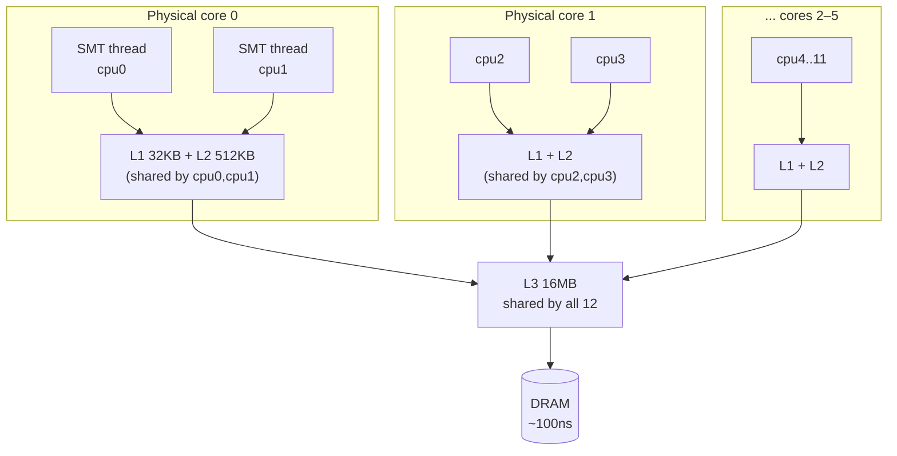
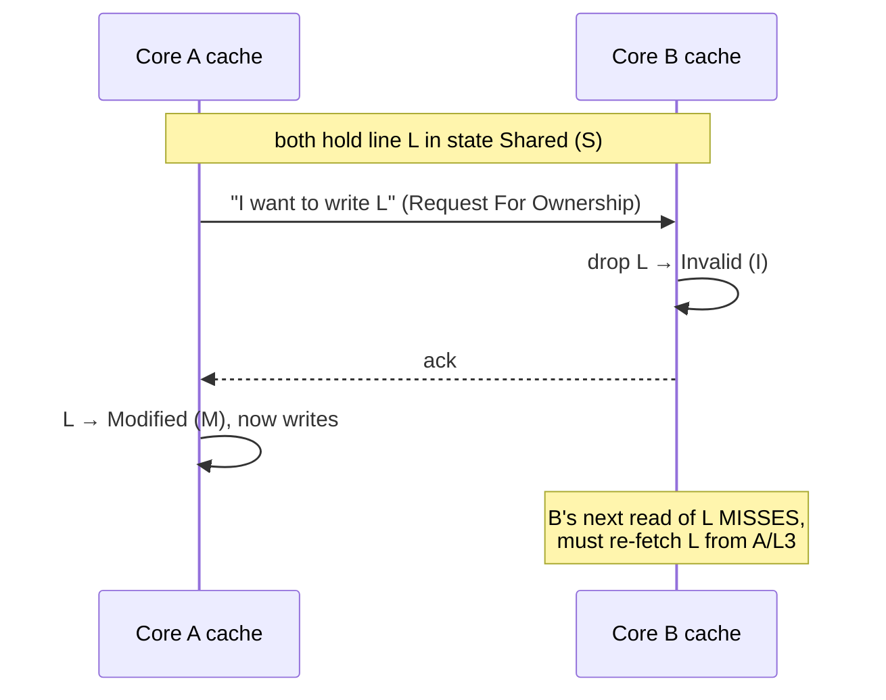
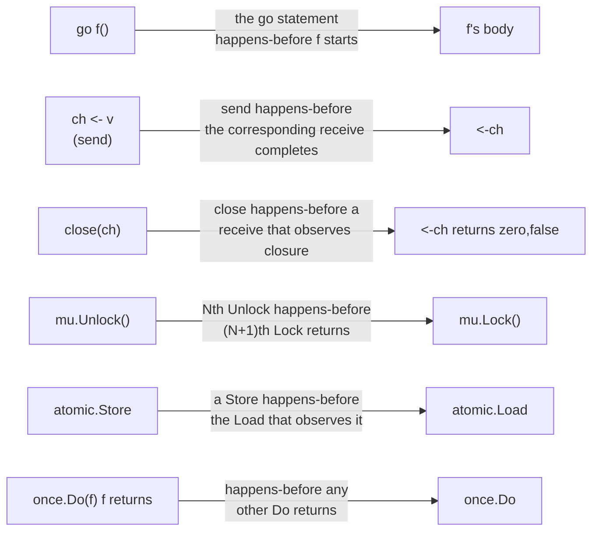

# Chapter 3 — The Memory Model & AMD64 Hardware

> *Chapters 1–2 told you goroutines can share memory safely "if you synchronize." This
> chapter is **why** that rule exists — down at the cache lines and store buffers of your
> Ryzen — and exactly what `sync/atomic` and the Go memory model guarantee.*

In Chapter 2 we wrote things like "after this channel receive, you're guaranteed to see the
sender's writes" and used `atomic.AddInt64` without justifying it. Those guarantees aren't
free — they're the visible tip of a deep stack:

```
Your Go source            x = 42; ready = true
   ↓ compiler may reorder/optimize
Machine instructions      MOV ...; MOV ...
   ↓ CPU may reorder, buffer, cache
What other cores observe  ??? — only synchronization pins this down
```

Two layers — the **compiler** and the **CPU** — are each free to reorder your memory
operations as long as a *single thread* can't tell. The moment a second core looks at the
same memory, those reorderings become visible, and "obvious" code breaks. The **memory model**
is the contract that tells you which reorderings you must defend against and how.

By the end you'll be able to answer:

- Why does a 64-byte struct layout decision cause a **32× slowdown** with zero logic change?
- What is a cache line, and what is **false sharing**?
- Why is x86 a "strong" memory model, and what's the *one* reordering it still allows?
- What is a **data race**, formally, and what **happens-before** edges remove it?
- Why is an atomic ~2× cheaper than a mutex — and why does that *still* not scale?

---

## 3.1 The cache hierarchy on your Ryzen 7535HS

The CPU does not read from RAM. It reads from a hierarchy of caches, and RAM is the slow
backstop. Here is *your* machine, read straight from `/sys/.../cache`:

```
AMD Ryzen 5 7535HS (Zen 3+)            access latency (typical, this class of core)
┌─────────────────────────────────────────────────────────────────────────────┐
│ Registers                              ~0 cycles                              │
├─────────────────────────────────────────────────────────────────────────────┤
│ L1d  32 KB  per core   line=64B     ~4–5 cycles   (~1 ns)                     │
│ L1i  32 KB  per core   line=64B                                              │
│   └── SHARED by the core's 2 SMT threads (cpu 0+1, 2+3, ...)                  │
├─────────────────────────────────────────────────────────────────────────────┤
│ L2  512 KB  per core   line=64B     ~12–15 cycles (~3–4 ns)                   │
│   └── also SHARED by the 2 SMT threads on that core                          │
├─────────────────────────────────────────────────────────────────────────────┤
│ L3  16 MB  shared by ALL 12 logical CPUs   line=64B   ~40–50 cycles (~12 ns) │
├─────────────────────────────────────────────────────────────────────────────┤
│ DRAM                                ~80–120 ns                                │
└─────────────────────────────────────────────────────────────────────────────┘
```



Three facts drive everything in this chapter:

1. **The unit of transfer is a 64-byte cache line, never a single byte.** Touch one `int64` and
   the CPU pulls in the surrounding 64 bytes. This is why data *layout* dominates performance.
2. **Latency spans ~100×** from L1 (~1 ns) to DRAM (~100 ns). A cache miss isn't a little slower;
   it's two orders of magnitude slower. "Cache-friendly" is not a micro-optimization.
3. **SMT siblings share L1 and L2** (your `shared_cpu_list` shows cpu0+cpu1 share, etc.). This is
   the hardware reason behind Chapter 1's warning that 12 logical CPUs ≠ 12× one core — two
   hyperthreads fight over the *same* L1/L2.

🔬 You can re-read your own topology any time:

```bash
lscpu | grep -i cache
# and per-level, including which CPUs share each cache:
for c in /sys/devices/system/cpu/cpu0/cache/index*; do
  echo "L$(cat $c/level) $(cat $c/type): $(cat $c/size), line $(cat $c/coherency_line_size)B, shared by $(cat $c/shared_cpu_list)"
done
```

---

## 3.2 Cache lines and spatial locality

Because memory moves in 64-byte lines, **data that's accessed together should live together.**
Iterating a `[]int64` is fast not just because arrays are contiguous, but because each cache-line
fetch brings in the next 8 elements for free. Chasing pointers through a linked list, by contrast,
can miss the cache on every node.

```
[]int64 in memory (one cache line = 64 bytes = 8 × int64):
┌───────────────────────────── 64 bytes ─────────────────────────────┐
│ a[0] │ a[1] │ a[2] │ a[3] │ a[4] │ a[5] │ a[6] │ a[7] │   ← one fetch │
└─────────────────────────────────────────────────────────────────────┘
Reading a[0] also loaded a[1..7]. The next 7 reads are L1 hits.
```

This is the bedrock of the performance work in Chapters 6–9 (and the 1BRC challenge in Ch 7,
where cache behavior *is* the whole game). But the same line-granularity that helps sequential
reads creates a nasty failure mode the moment **multiple cores** write to the same line.

---

## 3.3 Cache coherence: how cores agree (MESI), and the store buffer

Each core caches its own copy of memory. So what happens when core A and core B both cache the
same line and A writes to it? They must not see different values. The hardware guarantees this
with a **cache coherence protocol** — on AMD64, a MESI-family protocol. Each cached line is in
one of four states:

| State | Meaning |
|---|---|
| **M**odified | This core has the only copy and it's dirty (changed, not yet written back). |
| **E**xclusive | This core has the only copy and it's clean. |
| **S**hared | Multiple cores have a clean copy (read-only sharing — fine, fast). |
| **I**nvalid | This copy is stale; must re-fetch before use. |

The rule: **to write a line, a core must own it Exclusively.** If another core holds the line, the
writer must send a coherence message that **Invalidates** every other copy first.



That invalidate-and-refetch round trip is cheap when it's rare. When **two cores write the same
line in a tight loop**, the line "ping-pongs" between their caches — each write steals ownership
back, each read re-fetches. Every iteration pays an L3-or-worse latency instead of L1. Hold that
thought; §3.4 measures it.

### The store buffer (why writes don't stall the core)

Acquiring exclusive ownership takes time, and a core can't afford to stall on every write. So each
core has a **store buffer**: a write is dropped into the buffer and the core moves on immediately;
the buffer drains into the cache once ownership arrives. Loads check the local store buffer first
(so a core sees its *own* writes immediately).

This buffer is the source of the one reordering even x86 allows — coming up in §3.5.

---

## 3.4 False sharing: the 32× tax for sharing a cache line

**False sharing** is when two cores write to *different variables that happen to sit on the same
cache line.* Logically there's no sharing — the variables are independent. But the hardware works
in lines, not variables, so the line ping-pongs (§3.3) as if they were contending for one value.

```
8 int64 counters packed together = ONE 64-byte cache line:
┌──────────────────────── one cache line ────────────────────────┐
│ c[0] │ c[1] │ c[2] │ c[3] │ c[4] │ c[5] │ c[6] │ c[7] │          │
└─────────────────────────────────────────────────────────────────┘
   ▲core0  ▲core1  ▲core2 ...  each core writes ITS OWN counter,
   but every write invalidates the whole line in the other 7 cores.
```

🔬 [`code/ch03/falsesharing`](../code/ch03/falsesharing) runs exactly this: 8 goroutines, each
incrementing its own counter 2,000,000 times. The only difference between the two benchmarks is
whether each counter gets its own cache line:

```bash
go test -bench=. -benchmem ./ch03/falsesharing
```
```
BenchmarkFalseSharing-12        5    276525522 ns/op     # counters packed: 1 line
BenchmarkPadded-12            129      8527534 ns/op     # one line per counter
```

**≈ 32× slower**, with byte-identical logic. The packed version's single cache line bounces between
all 12 logical CPUs; the padded version lets each core keep its counter Exclusive in its own L1 and
never talk to the others. The fix is pure layout — pad each counter to a full line:

```go
type padded struct {
    count int64
    _     [56]byte // 8 (int64) + 56 = 64 bytes → its own cache line
}
```

📐 **When to care.** False sharing only bites *write-heavy, per-core hot* data: sharded counters,
per-P/per-worker stats, ring-buffer head/tail indices, lock structures. Don't pad everything —
padding wastes cache and hurts the common case. Pad the *specific* hot fields that multiple cores
write concurrently. (The Go runtime itself does this; you'll see `_ [cpu.CacheLinePad]byte` in its
source, e.g. around per-P scheduler state.) We'll use this directly when sharding in Chapter 4.

---

## 3.5 Memory ordering: x86-TSO and the one reordering it allows

Coherence (§3.3) guarantees all cores eventually agree on the value of *each single location*.
**Ordering** is a different question: in what order does core B observe core A's writes to
*different* locations? That's governed by the architecture's **memory model**.

x86-64 implements **TSO — Total Store Order**, one of the *strongest* commodity models. Under TSO:

- **Loads are not reordered with other loads.** ✅
- **Stores are not reordered with other stores.** ✅ (stores hit other cores in program order)
- **A load is not reordered with an *earlier* load.** ✅
- ❗ **A load *may* be reordered before an earlier store to a *different* address.** This is the
  **one** relaxation — and it comes straight from the store buffer (§3.3): your store sits in the
  buffer while a later load to a different address completes from cache.

```
Program order on core A:        What core B may observe:
   STORE x = 1   (sits in           the LOAD of y can complete
   LOAD  y       store buffer)  -->  BEFORE x=1 is visible to others
```

This **store→load reordering** is the basis of the famous Dekker/Peterson litmus test where two
threads each "set my flag, read yours" and *both* can read 0. On weak architectures (ARM, POWER)
*many* more reorderings are allowed; x86 only this one. That's why x86 is "strong" — and why code
with missing synchronization often *appears* to work on your AMD desktop but corrupts on an ARM
server. **Never rely on the hardware model; rely on the Go memory model**, which is portable.

📐 **A note specific to Go:** you generally *cannot* reproduce store→load reordering in pure Go,
because `sync/atomic` is **sequentially consistent** (§3.6) — its operations compile to `LOCK`-prefixed
instructions / fences that drain the store buffer. The only way to "see" the reordering is to write
a data race with plain variables, i.e. undefined behavior. The lesson isn't "exploit TSO"; it's
"the moment you skip synchronization, you've signed up for whatever the weakest target allows."

---

## 3.6 `sync/atomic`: sequentially-consistent operations

Go deliberately keeps things simple: **all `sync/atomic` operations are sequentially consistent.**
There is no relaxed/acquire/release/seq-cst menu like C++ — one strong default that's hard to
misuse. An atomic store is globally ordered with respect to all other atomic operations, and it
acts as a full barrier that also publishes the non-atomic writes sequenced before it (that's the
publication guarantee we exploit in §3.7).

The toolbox (Go 1.19+ added the **typed** atomics, which are now preferred):

| Typed (preferred) | Raw function | Does |
|---|---|---|
| `atomic.Int64`, `Int32`, `Uint64`, `Bool` | `atomic.AddInt64`, … | `Load`, `Store`, `Add`, `Swap`, `CompareAndSwap` |
| `atomic.Pointer[T]` | `atomic.SwapPointer`, … | atomic pointer load/store/CAS — the basis of lock-free structures (Ch 4) |
| `atomic.Value` | — | atomically store/load an `interface{}` of one concrete type (e.g. hot-swap a config) |

Prefer the typed forms: they can't be accidentally mixed with non-atomic access to the same word
(a classic bug — *every* access to an atomically-managed variable must go through atomic ops), and
they guarantee correct alignment. ⚠️ With the **raw** functions on 32-bit platforms, a 64-bit value
must be 64-bit aligned or `Add/Load` panics; the typed `atomic.Int64` handles this for you.

### Atomic vs mutex — cheaper, but not a scaling free pass

🔬 [`code/ch03/atomicvsmutex`](../code/ch03/atomicvsmutex) increments one shared counter from
`GOMAXPROCS` goroutines three ways:

```bash
go test -bench=. ./ch03/atomicvsmutex
```
```
BenchmarkMutexCounter-12     33209248     39.18 ns/op
BenchmarkAtomicRaw-12        67953759     17.85 ns/op
BenchmarkAtomicTyped-12      63651738     21.26 ns/op
```

The atomic is **~2× faster** than the mutex: a single `LOCK XADD` instruction with no possibility
of parking, versus the mutex's CAS + bookkeeping + (under contention) futex parking. The typed
atomic costs a hair more than the raw call (a method-call indirection) and is worth it for safety.

But notice both numbers are *tens of nanoseconds*, not single-digit — because **both serialize on
the one counter's cache line** (§3.3 ping-pong again). An atomic removes the *lock*, not the
*coherence traffic*. To actually scale a hot counter across cores you must stop sharing the line:
**shard** it (per-P / per-core counters summed on read), which is exactly false-sharing-avoidance
(§3.4) applied on purpose. That technique, and true lock-free structures, are Chapter 4.

---

## 3.7 The Go memory model: data races and happens-before

Now we can state the actual contract. The Go memory model is defined in terms of **happens-before**,
a partial order over memory operations.

> If event *A* **happens-before** event *B*, then *A*'s memory writes are guaranteed visible to *B*.
> If neither happens-before the other **and** they touch the same location **and** at least one is a
> write — that's a **data race**, and the program's behavior is **undefined**.

"Undefined" is not "you read a slightly stale value." A racy program may read torn values, loop
forever, or crash. Don't reason about *what* a race does; eliminate it.

### The happens-before edges you actually get

You create happens-before with synchronization. The edges that matter in everyday Go:



| Edge | Rule |
|---|---|
| **Goroutine start** | The `go f()` statement happens-before `f` begins. (So `f` sees everything set up before `go`.) |
| **Channel send→receive** | A send on a channel happens-before the corresponding receive *completes*. (The Ch 2 guarantee, now justified.) |
| **Channel close→receive** | A `close` happens-before a receive that returns because the channel is closed. |
| **Channel receive→send (buffered, cap k)** | The *k*-th receive happens-before the (*k+C*)-th send completes — back-pressure as ordering. |
| **Mutex** | For a `sync.Mutex`, the *n*-th `Unlock` happens-before the (*n+1*)-th `Lock` returns. |
| **`sync.Once`** | The single `f()` inside `once.Do(f)` happens-before any `Do` call returns. |
| **Atomics** | A sequentially-consistent atomic op happens-before any atomic op that observes its effect. |

⚠️ **Goroutine *exit* has NO happens-before edge by itself.** A goroutine finishing does **not**
publish its writes to anyone — you must join with a channel, `WaitGroup`, or `errgroup`. "I started
a goroutine, it set a variable, then it returned, so now I can read the variable" is a **race**.

### Publication, demonstrated

🔬 [`code/ch03/racedemo`](../code/ch03/racedemo) is the smallest interesting case: a writer does
`data = 42; ready = true`, a reader spins on `ready` then reads `data`. With plain variables there's
no happens-before edge between the goroutines — a data race:

```bash
go run -race ./ch03/racedemo          # WARNING: DATA RACE  (on data and ready)
go run -race ./ch03/racedemo -fixed   # clean — uses atomic.Bool
```

The fix turns `ready` into an `atomic.Bool`. The writer's `data = 42` is *sequenced before* its
`ready.Store(true)`; when the reader's `ready.Load()` observes `true`, the atomic edge guarantees it
also observes `data == 42`. **One atomic flag publishes every ordinary write made before it** — this
"publish a pointer/flag atomically" move is the foundation of lock-free data structures in Chapter 4.

### Always run `-race` in CI

The race detector (`-go test -race`, `go run -race`) instruments memory accesses and reports any
race it *observes at runtime*. It has false negatives (it can only catch races on code paths that
actually execute) but **never false positives** — a report is always a real bug. It's the single
highest-leverage tool for concurrent Go. Run your tests with `-race` in CI, always.

---

## 3.8 Struct alignment and padding

Every type has an **alignment**: its address must be a multiple of that value (an `int64` is
8-aligned, `int32` 4-aligned, `bool` 1-aligned). The compiler inserts **padding** so every field
is aligned and the struct's size is a multiple of its own alignment. Field *order* therefore changes
struct *size*.

🔬 [`code/ch03/alignment`](../code/ch03/alignment):

```bash
go run ./ch03/alignment
```
```
sizeof(bad)  = 32 bytes  (align 8)
sizeof(good) = 16 bytes  (align 8)
field offsets in bad:   a@0 b@8 c@16 d@20 e@24
field offsets in good:  b@0 d@8 a@12 c@13 e@14
```

Same five fields (`bool, int64, bool, int32, bool`); reordering largest→smallest **halved** the
struct. The `bad` layout wastes 7 bytes after the first `bool` (to 8-align the `int64`), then more:

```
bad  (32B):  a · · · · · · ·  bbbbbbbb  c · · ·  dddd  e · · · · · · ·
             ^bool +7 pad     ^int64    ^+3 pad  ^i32  ^bool +7 trailing pad
good (16B):  bbbbbbbb  dddd  a c e ·
             ^int64    ^i32  ^3 bools +1 pad
```

Why it matters beyond memory: smaller structs fit **more elements per cache line**, so slices of
them iterate with fewer misses (§3.2). On a hot `[]struct` this is real throughput.

✅ **Tooling:** `go vet`'s `fieldalignment` analyzer finds and even auto-fixes these:

```bash
go vet -vettool=$(which fieldalignment) ./...   # or: fieldalignment -fix ./...
```

📐 Don't hand-reorder every struct for sport — it hurts readability and rarely matters for structs
you allocate a few of. Do it for **hot, numerous** structs (per-request, per-row, slice elements).
Clarity first; reorder where the profiler (Ch 6) says it pays.

---

## 3.9 Putting it together — the engineer's rules

1. **Think in 64-byte lines, not variables.** Layout decisions are performance decisions because
   the cache moves lines.
2. **Keep concurrently-written hot data on separate lines** (pad sharded counters/indices) — §3.4's
   32× is the price of getting this wrong.
3. **Keep read-mostly data together and compact** (field-order, small structs) so it cache-fits — §3.2/§3.8.
4. **Synchronize, don't rely on the hardware.** x86-TSO will forgive you; ARM won't. Use channels,
   mutexes, or atomics to create the happens-before edge you need.
5. **An atomic removes the lock, not the cache-line contention.** To scale a hot word, shard it (Ch 4).
6. **Run `-race` in CI.** A report is always a real bug.

---

## 3.10 Pitfalls & gotchas

- ⚠️ **Relying on goroutine exit to publish writes.** It doesn't. Join via channel/`WaitGroup`/`errgroup`.
- ⚠️ **Mixing atomic and non-atomic access** to the same variable. *Every* access must be atomic, or
  it's a race. Typed atomics (`atomic.Int64`) make this structurally hard to get wrong — prefer them.
- ⚠️ **"It passes on my machine."** Your AMD desktop is x86-TSO (strong). The same race can corrupt
  on an ARM CI runner or production node. Strong hardware hides bugs; the race detector reveals them.
- ⚠️ **Padding everything.** Padding burns cache and hurts the common (single-writer) case. Pad only
  the specific fields multiple cores write concurrently.
- ⚠️ **Forgetting `sync/atomic` alignment on 32-bit** when using the raw functions on a 64-bit value
  (must be 8-byte aligned, e.g. first field of a struct). Typed atomics avoid this entirely.
- ⚠️ **Assuming `atomic` scales.** It serializes on one cache line just like a mutex does; it's faster
  per-op, not contention-free. Measure (Ch 6), then shard (Ch 4).

---

## 3.11 Summary

- The CPU reads **64-byte cache lines** through a hierarchy — on your Ryzen 7535HS: 32 KB L1 +
  512 KB L2 **per core (shared by the 2 SMT threads)**, 16 MB L3 shared by all 12. Latency spans
  ~100× from L1 to DRAM, so **data layout is performance**.
- **Cache coherence (MESI)** keeps cores agreeing on each location; a write needs **Exclusive**
  ownership, which **Invalidates** other copies. When two cores write the same line, it **ping-pongs**.
- **False sharing** — independent variables on one line — triggers that ping-pong. Measured **≈32×**
  slowdown here; the fix is **cache-line padding** of the specific hot fields.
- x86-64 is **TSO**, a strong model that allows only **store→load reordering** (the store buffer).
  Weak architectures allow much more — so **rely on the Go memory model, never the hardware**.
- `sync/atomic` is **sequentially consistent**; prefer the **typed** atomics. An atomic is **~2×**
  cheaper than a mutex but still serializes on one cache line — it removes the lock, not the contention.
- The Go memory model is **happens-before**: channel send→recv, mutex unlock→lock, atomic store→load,
  `go` start, `Once`. No edge + same location + a write = a **data race** = undefined behavior.
  **Goroutine exit publishes nothing.** Run **`-race`** in CI.

### Where this goes next

You now have everything lock-free programming needs: atomic CAS, the publication guarantee, cache-line
awareness, and the happens-before contract. **Chapter 4 — Lock-Free Programming in Go** builds real
structures on this foundation — a Treiber stack, an MPSC/MPMC queue, a sharded counter, and a SPSC
ring buffer — and, just as importantly, shows *when a plain mutex still wins.*

> **Run everything:** `cd go-advanced/code`
> · `go test -bench=. ./ch03/falsesharing ./ch03/atomicvsmutex`
> · `go run ./ch03/alignment`
> · `go run -race ./ch03/racedemo` (and `-fixed`)
> See [`code/ch03/`](../code/ch03).
