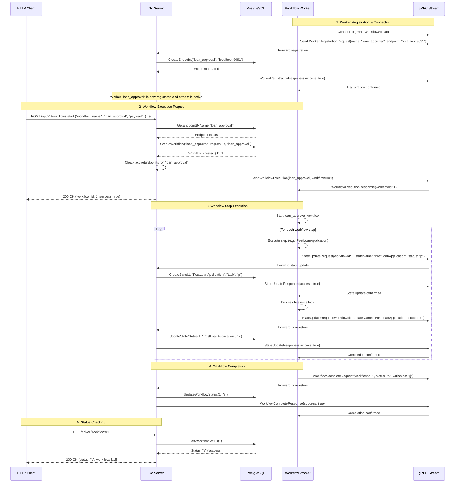

# Workflow Engine System Flow

## Architecture Overview

The workflow engine uses bidirectional gRPC streaming for real-time communication between the server and workers. This allows for immediate workflow execution and state tracking.

## Sequence Diagram



## Key Improvements Made

### 1. **Stream-Based Registration**

- Workers now register themselves via the gRPC stream as the first message
- Server associates the stream with the endpoint name
- No separate registration call needed

### 2. **Endpoint-to-Stream Association**

- Server tracks streams by endpoint name instead of random IDs
- When a workflow request comes in, server finds the exact worker for that workflow
- Direct routing: `loan_approval` workflow → `loan_approval` worker

### 3. **Real-time State Tracking**

- All state changes are immediately sent to server via stream
- Database is updated in real-time
- Server acknowledges each state change

### 4. **Persistent Connections**

- Workers maintain persistent gRPC connections
- Automatic cleanup when workers disconnect
- Server tracks active connections for availability checking

## Database Schema

```sql
-- Endpoints table
waves.endpoint (id, name, endpoint, created_at, updated_at)

-- Workflows table
waves.workflow (id, name, rid, type, status, created_at, updated_at)

-- States table
waves.state (id, workflow_id, name, type, status, created_at, updated_at)

-- Variables table
waves.variables (id, workflow_id, data, created_at, updated_at)
```

## Workflow Steps

The `loan_approval` workflow has 7 steps:

1. **PostLoanApplication** (task) → Process loan application
2. **PostLoanApplicationCond** (condition) → Check if application is valid
3. **PanVerification** (task) → Verify PAN number
4. **PanVerificationCond** (condition) → Check PAN verification result
5. **AadhaarVerification** (task) → Verify Aadhaar number
6. **AadhaarVerificationCond** (condition) → Check Aadhaar result
7. **SendCallback** (task) → Send final callback

Each step updates its state: `p` (pending) → `s` (success) or `f` (failed)

## API Endpoints

- **POST** `/api/v1/workflows/start` - Start a workflow
- **GET** `/api/v1/workflows/:id` - Get workflow status
- **GET** `/api/v1/connections` - List active worker connections
- **GET** `/health` - Health check

## Success Indicators

✅ Worker registration: "Worker loan_approval registered with stream"
✅ Endpoint creation: "Created new endpoint: loan_approval -> localhost:9091"  
✅ Active connections: "1 active connections"
✅ Workflow execution: "Workflow execution started: ID 1"
✅ State tracking: All state updates confirmed
✅ Completion: "Workflow completed successfully"

The system now provides real-time workflow execution with persistent worker connections, making it ready for high-performance benchmarking across Go, Java, and Kotlin implementations!
